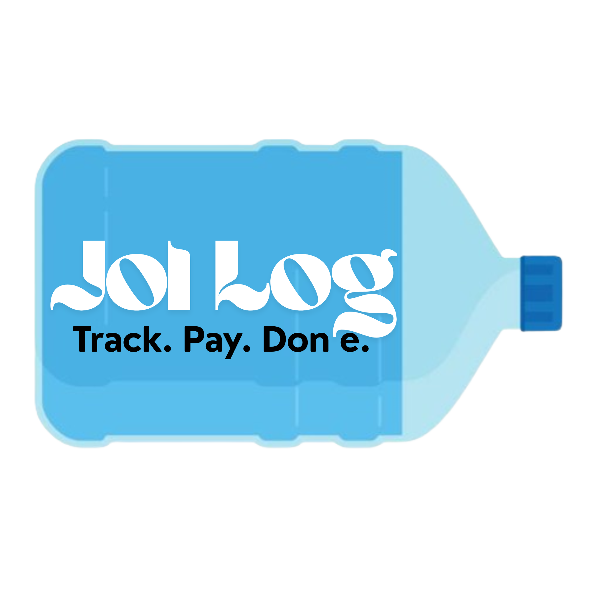

<p align="center">
  
</p>

<h1 align="center">JolLog</h1>

<p align="center">
  <strong>Simple water delivery and payment tracker</strong><br/>
  Track. Pay. Done.
</p>

<p align="center">
  <a href="https://jollog.vercel.app">Live Demo</a>
</p>

A Progressive Web App (PWA) for tracking water bottle deliveries and payments to distributors.

## Features

- **Multi-account support** — Track multiple water distributors
- **Delivery tracking** — Log bottle deliveries with quantities and rates
- **Payment tracking** — Record payments against accounts
- **Due calculation** — Automatic balance due calculation
- **Offline support** — Works without internet (PWA)
- **Responsive design** — Works on mobile and desktop

<!-- ## Getting Started

```bash
# Install dependencies
pnpm install

# Start dev server
pnpm dev

# Build for production
pnpm build

# Preview production build
pnpm preview
``` -->

## Install as PWA on Mobile

**Android (Chrome):**
1. Open `https://jollog.vercel.app` in Chrome
2. Tap the **Install** prompt that appears, or go to **Menu → Install app**
3. Confirm and the app will be added to your home screen

**iOS (Safari):**
1. Open `https://jollog.vercel.app` in Safari
2. Tap the **Share** button (square with arrow)
3. Scroll and tap **Add to Home Screen**
4. Tap **Add** to confirm
